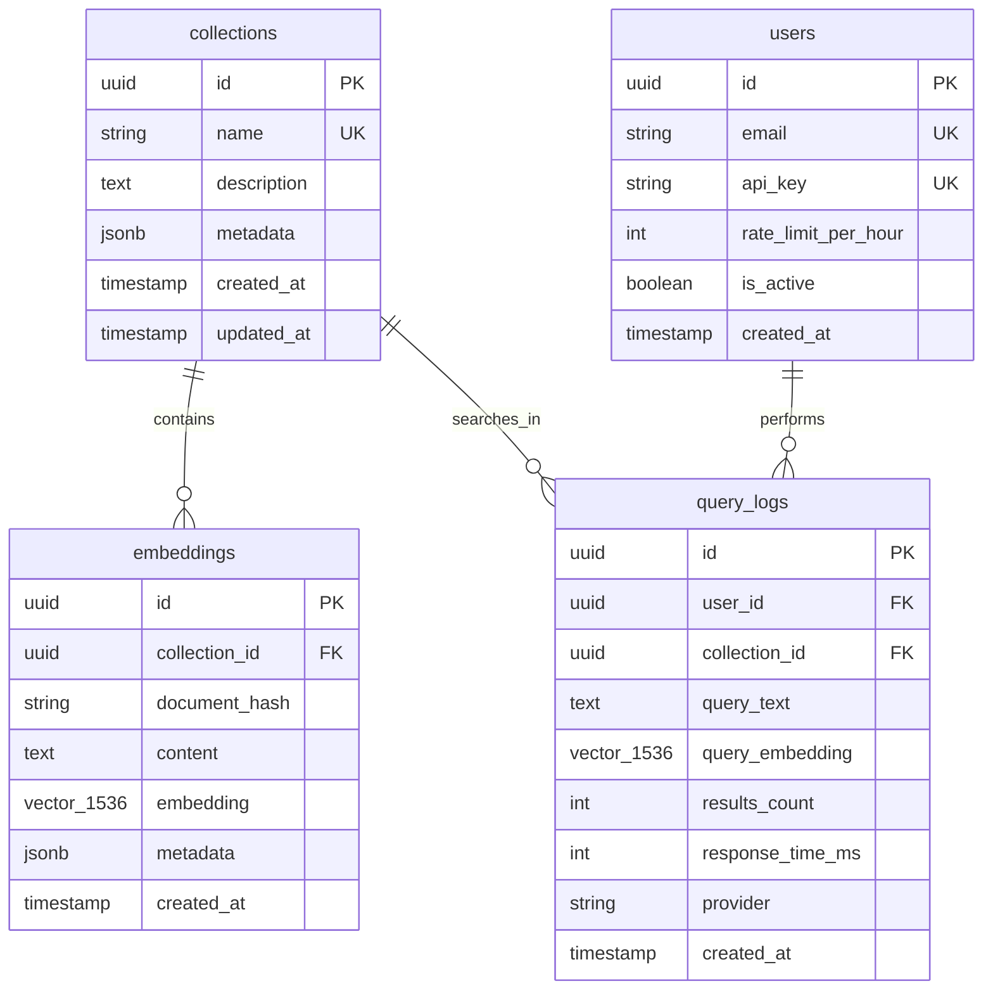

# pgVector Database Comprehensive Guide

## Table of Contents
1. [Overview](#overview)
2. [Database Schema](#database-schema)
3. [Table Structures and Use Cases](#table-structures-and-use-cases)
4. [Data Types and Storage](#data-types-and-storage)
5. [Query Examples](#query-examples)
6. [Learning Guide for Vector Queries](#learning-guide-for-vector-queries)
7. [Performance Optimization](#performance-optimization)
8. [Best Practices](#best-practices)

## Overview

This RAG (Retrieval-Augmented Generation) API uses PostgreSQL with the pgVector extension to store and search through high-dimensional vector embeddings. The database is designed for efficient similarity search, multi-tenancy, and analytics.

### Key Features
- **Vector Similarity Search**: Find semantically similar documents using cosine similarity
- **Multi-tenancy**: Organize documents into collections with user management
- **Deduplication**: Prevent duplicate documents using SHA-256 hashing
- **Analytics**: Track queries and performance metrics
- **Backward Compatibility**: Support for existing LangChain schemas

## Database Schema



## Table Structures and Use Cases

### 1. Collections Table

**Purpose**: Organize embeddings into logical groups for better management and multi-tenancy.

**Use Cases**:
- **Document Categories**: Separate technical docs, marketing content, legal documents
- **Client Isolation**: Each client gets their own collection for data privacy
- **Version Control**: Different versions of the same document set
- **Domain Separation**: Medical, legal, technical knowledge bases

**Data Structure**:
```sql
CREATE TABLE collections (
    id UUID PRIMARY KEY DEFAULT uuid_generate_v4(),
    name VARCHAR(255) NOT NULL UNIQUE,           -- e.g., "medical-docs", "client-acme"
    description TEXT,                            -- Human-readable description
    metadata JSONB DEFAULT '{}',                 -- Custom properties, tags, settings
    created_at TIMESTAMP WITH TIME ZONE DEFAULT NOW(),
    updated_at TIMESTAMP WITH TIME ZONE DEFAULT NOW()
);
```

**Example Data**:
```json
{
  "id": "123e4567-e89b-12d3-a456-426614174000",
  "name": "medical-research-2024",
  "description": "Medical research papers from 2024",
  "metadata": {
    "domain": "healthcare",
    "language": "en",
    "access_level": "restricted",
    "tags": ["research", "medical", "2024"]
  }
}
```

### 2. Embeddings Table

**Purpose**: Store document content with their vector representations for similarity search.

**Use Cases**:
- **Document Search**: Find similar documents based on semantic meaning
- **Question Answering**: Retrieve relevant context for LLM responses
- **Content Recommendation**: Suggest related articles or documents
- **Duplicate Detection**: Identify similar or duplicate content

**Data Structure**:
```sql
CREATE TABLE embeddings (
    id UUID PRIMARY KEY DEFAULT uuid_generate_v4(),
    collection_id UUID NOT NULL REFERENCES collections(id),
    document_hash VARCHAR(64) NOT NULL,          -- SHA-256 for deduplication
    content TEXT NOT NULL,                       -- Original document text
    embedding vector(1536) NOT NULL,            -- OpenAI ada-002 embedding
    metadata JSONB DEFAULT '{}',                 -- Document-specific metadata
    created_at TIMESTAMP WITH TIME ZONE DEFAULT NOW(),
    UNIQUE(collection_id, document_hash)         -- Prevent duplicates per collection
);
```

**Example Data**:
```json
{
  "id": "456e7890-e89b-12d3-a456-426614174001",
  "collection_id": "123e4567-e89b-12d3-a456-426614174000",
  "document_hash": "a1b2c3d4e5f6...",
  "content": "Machine learning is a subset of artificial intelligence...",
  "embedding": [0.1, -0.3, 0.7, ...],  // 1536 dimensions
  "metadata": {
    "title": "Introduction to Machine Learning",
    "author": "Dr. Smith",
    "source": "research-paper.pdf",
    "page": 1,
    "chunk_index": 0,
    "word_count": 250
  }
}
```

### 3. Users Table

**Purpose**: Manage API access, rate limiting, and user analytics.

**Use Cases**:
- **API Key Management**: Secure access to the vector database
- **Rate Limiting**: Prevent abuse and manage costs
- **User Analytics**: Track usage patterns per user
- **Multi-tenant Access**: Control which collections users can access

**Data Structure**:
```sql
CREATE TABLE users (
    id UUID PRIMARY KEY DEFAULT uuid_generate_v4(),
    email VARCHAR(255) NOT NULL UNIQUE,
    api_key VARCHAR(255) NOT NULL UNIQUE,
    rate_limit_per_hour INTEGER DEFAULT 1000,
    is_active BOOLEAN DEFAULT true,
    created_at TIMESTAMP WITH TIME ZONE DEFAULT NOW()
);
```

### 4. Query Logs Table

**Purpose**: Track search queries for analytics, debugging, and optimization.

**Use Cases**:
- **Performance Monitoring**: Track response times and identify slow queries
- **Usage Analytics**: Understand search patterns and popular queries
- **Cost Optimization**: Monitor embedding API usage
- **Query Optimization**: Identify frequently searched topics

**Data Structure**:
```sql
CREATE TABLE query_logs (
    id UUID PRIMARY KEY DEFAULT uuid_generate_v4(),
    user_id UUID REFERENCES users(id),
    collection_id UUID REFERENCES collections(id),
    query_text TEXT NOT NULL,
    query_embedding vector(1536),
    results_count INTEGER,
    response_time_ms INTEGER,
    provider VARCHAR(50),                        -- 'openai', 'bedrock', etc.
    created_at TIMESTAMP WITH TIME ZONE DEFAULT NOW()
);
```

## Data Types and Storage

### Vector Data Type
```sql
-- pgVector specific type for storing embeddings
embedding vector(1536)  -- 1536 dimensions for OpenAI ada-002
```

### JSONB Metadata
```sql
-- Flexible metadata storage
metadata JSONB DEFAULT '{}'

-- Example metadata structures:
-- Document metadata
{
  "title": "Document Title",
  "author": "Author Name",
  "source": "source-file.pdf",
  "page": 1,
  "section": "Introduction",
  "tags": ["ai", "machine-learning"],
  "language": "en",
  "created_date": "2024-01-15"
}

-- Collection metadata
{
  "domain": "healthcare",
  "access_level": "public",
  "embedding_model": "text-embedding-ada-002",
  "chunk_size": 1000,
  "overlap": 200
}
```

### UUID Primary Keys
All tables use UUID primary keys for:
- **Global uniqueness**: No conflicts across distributed systems
- **Security**: Non-sequential, harder to guess
- **Scalability**: Better for distributed databases

## Query Examples

### 1. Basic Vector Similarity Search

```sql
-- Find most similar documents to a query embedding
SELECT 
    e.id,
    e.content,
    e.metadata,
    c.name as collection_name,
    1 - (e.embedding <=> $1::vector) as similarity_score
FROM embeddings e
JOIN collections c ON e.collection_id = c.id
WHERE c.name = 'medical-research-2024'
ORDER BY e.embedding <=> $1::vector
LIMIT 5;
```

**Parameters**: `$1` = query embedding vector (1536 dimensions)

### 2. Filtered Vector Search

```sql
-- Search with metadata filters
SELECT 
    e.content,
    e.metadata->>'title' as title,
    e.metadata->>'author' as author,
    1 - (e.embedding <=> $1::vector) as similarity
FROM embeddings e
JOIN collections c ON e.collection_id = c.id
WHERE c.name = $2
  AND e.metadata->>'domain' = 'healthcare'
  AND e.metadata->>'language' = 'en'
  AND (e.embedding <=> $1::vector) < 0.5  -- Similarity threshold
ORDER BY e.embedding <=> $1::vector
LIMIT 10;
```

### 3. Multi-Collection Search

```sql
-- Search across multiple collections
SELECT 
    e.content,
    c.name as collection,
    e.metadata,
    1 - (e.embedding <=> $1::vector) as similarity
FROM embeddings e
JOIN collections c ON e.collection_id = c.id
WHERE c.name = ANY($2::text[])  -- Array of collection names
ORDER BY e.embedding <=> $1::vector
LIMIT 20;
```

### 4. Hybrid Search (Vector + Text)

```sql
-- Combine vector similarity with text search
SELECT 
    e.content,
    e.metadata,
    1 - (e.embedding <=> $1::vector) as vector_similarity,
    ts_rank(to_tsvector('english', e.content), plainto_tsquery('english', $2)) as text_rank
FROM embeddings e
JOIN collections c ON e.collection_id = c.id
WHERE c.name = $3
  AND to_tsvector('english', e.content) @@ plainto_tsquery('english', $2)
ORDER BY 
    (1 - (e.embedding <=> $1::vector)) * 0.7 +  -- 70% vector weight
    ts_rank(to_tsvector('english', e.content), plainto_tsquery('english', $2)) * 0.3  -- 30% text weight
    DESC
LIMIT 10;
```

### 5. Analytics Queries

```sql
-- Most popular search queries
SELECT 
    query_text,
    COUNT(*) as search_count,
    AVG(response_time_ms) as avg_response_time,
    AVG(results_count) as avg_results
FROM query_logs
WHERE created_at >= NOW() - INTERVAL '7 days'
GROUP BY query_text
ORDER BY search_count DESC
LIMIT 20;

-- Collection usage statistics
SELECT 
    c.name,
    COUNT(DISTINCT e.id) as document_count,
    COUNT(DISTINCT ql.id) as query_count,
    AVG(ql.response_time_ms) as avg_response_time
FROM collections c
LEFT JOIN embeddings e ON c.id = e.collection_id
LEFT JOIN query_logs ql ON c.id = ql.collection_id
WHERE ql.created_at >= NOW() - INTERVAL '30 days'
GROUP BY c.id, c.name
ORDER BY query_count DESC;
```

## Learning Guide for Vector Queries

### Understanding Vector Similarity

1. **Distance Operators**:
   - `<->` : Euclidean distance (L2)
   - `<#>` : Negative inner product
   - `<=>` : Cosine distance (most common for text embeddings)

2. **Similarity Score Calculation**:
   ```sql
   -- Cosine similarity (0 to 1, where 1 is identical)
   1 - (embedding <=> query_vector) as similarity
   
   -- Distance (0 to 2, where 0 is identical)
   embedding <=> query_vector as distance
   ```

### Query Performance Tips

1. **Use Indexes**:
   ```sql
   -- IVFFlat index for approximate nearest neighbor search
   CREATE INDEX embeddings_vector_cosine_idx 
   ON embeddings USING ivfflat (embedding vector_cosine_ops) 
   WITH (lists = 100);
   ```

2. **Limit Results**:
   ```sql
   -- Always use LIMIT to prevent expensive full table scans
   ORDER BY embedding <=> $1::vector LIMIT 10;
   ```

3. **Filter Early**:
   ```sql
   -- Apply filters before vector search when possible
   WHERE collection_id = $1 AND metadata->>'type' = 'article'
   ORDER BY embedding <=> $2::vector
   ```

### Common Query Patterns

1. **Semantic Search**:
   ```typescript
   // Generate embedding for user query
   const queryEmbedding = await embeddingService.generateEmbedding(userQuery);
   
   // Search for similar documents
   const results = await knex('embeddings')
     .select('content', 'metadata')
     .select(knex.raw('1 - (embedding <=> ?) as similarity', [queryEmbedding]))
     .where('collection_id', collectionId)
     .orderByRaw('embedding <=> ?', [queryEmbedding])
     .limit(5);
   ```

2. **Contextual Retrieval**:
   ```typescript
   // Find context for RAG
   const context = await knex('embeddings')
     .select('content')
     .where('collection_id', collectionId)
     .whereRaw('(embedding <=> ?) < ?', [queryEmbedding, 0.3]) // Similarity threshold
     .orderByRaw('embedding <=> ?', [queryEmbedding])
     .limit(3);
   ```

## Performance Optimization

### Index Configuration

```sql
-- Optimize IVFFlat index
CREATE INDEX CONCURRENTLY embeddings_vector_cosine_idx 
ON embeddings USING ivfflat (embedding vector_cosine_ops) 
WITH (lists = 100);  -- Adjust lists based on data size

-- Rule of thumb: lists = rows / 1000, but between 10-1000
-- For 100K documents: lists = 100
-- For 1M documents: lists = 1000
```

### Query Optimization

1. **Use Connection Pooling**:
   ```typescript
   const knex = Knex({
     client: 'pg',
     connection: {
       // connection config
     },
     pool: {
       min: 2,
       max: 10
     }
   });
   ```

2. **Batch Operations**:
   ```typescript
   // Insert multiple embeddings at once
   await knex('embeddings').insert(embeddingsBatch);
   ```

3. **Prepared Statements**:
   ```typescript
   // Knex automatically uses prepared statements
   const results = await knex('embeddings')
     .where('collection_id', collectionId)
     .orderByRaw('embedding <=> ?', [queryEmbedding]);
   ```

## Best Practices

### 1. Data Organization
- **Use collections** to separate different types of content
- **Include rich metadata** for filtering and analytics
- **Implement deduplication** using document hashes

### 2. Query Design
- **Always use LIMIT** to prevent expensive operations
- **Filter before vector search** when possible
- **Use appropriate similarity thresholds** (typically 0.1-0.5 for cosine distance)

### 3. Monitoring
- **Track query performance** using query_logs table
- **Monitor index usage** and rebuild when necessary
- **Set up alerts** for slow queries (>1000ms)

### 4. Security
- **Use API keys** for access control
- **Implement rate limiting** to prevent abuse
- **Validate input** to prevent SQL injection

### 5. Scaling
- **Partition large tables** by collection_id or date
- **Use read replicas** for query-heavy workloads
- **Consider sharding** for very large datasets (>10M embeddings)

## Example Application Code

### Inserting Documents
```typescript
async function addDocument(collectionName: string, content: string, metadata: any) {
  // Generate embedding
  const embedding = await embeddingService.generateEmbedding(content);
  
  // Create document hash for deduplication
  const documentHash = crypto.createHash('sha256').update(content).digest('hex');
  
  // Get collection ID
  const collection = await knex('collections').where('name', collectionName).first();
  
  // Insert embedding
  await knex('embeddings').insert({
    collection_id: collection.id,
    document_hash: documentHash,
    content,
    embedding,
    metadata
  }).onConflict(['collection_id', 'document_hash']).ignore(); // Handle duplicates
}
```

### Searching Documents
```typescript
async function searchDocuments(query: string, collectionName: string, limit: number = 5) {
  // Generate query embedding
  const queryEmbedding = await embeddingService.generateEmbedding(query);
  
  // Search for similar documents
  const results = await knex('embeddings as e')
    .join('collections as c', 'e.collection_id', 'c.id')
    .select('e.content', 'e.metadata')
    .select(knex.raw('1 - (e.embedding <=> ?) as similarity', [queryEmbedding]))
    .where('c.name', collectionName)
    .orderByRaw('e.embedding <=> ?', [queryEmbedding])
    .limit(limit);
    
  return results;
}
```

This guide provides a comprehensive understanding of how to work with pgVector databases for RAG applications. Start with basic similarity searches and gradually incorporate more advanced features like filtering, analytics, and optimization techniques.
